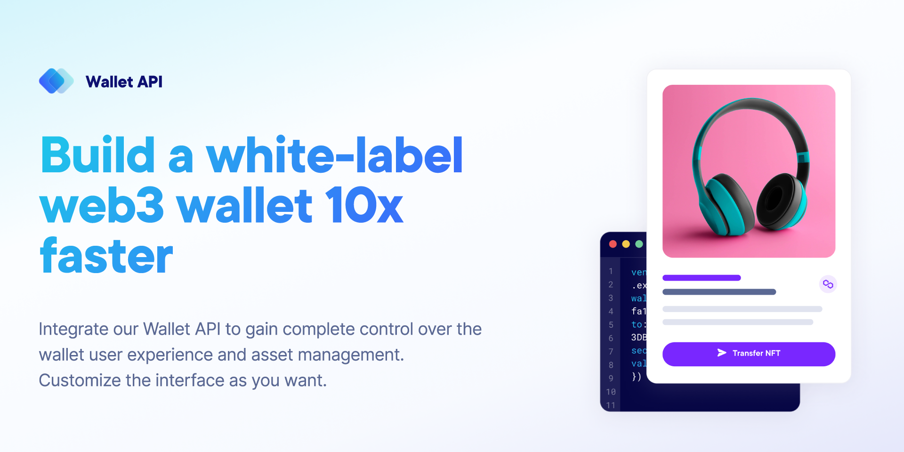

# Wallet API

The Wallet API allows developers to interact with blockchain networks and offer wallet functionality to their users without having to build everything from scratch. This can include features like account creation, transaction management, balance inquiries, and more.

- Welcome your users with custom wallet branding. You can customize the user interface to your taste.
- You are completely in charge of the wallet user experience to optimize user conversion. Get total freedom with regard to UX and asset management with our Wallet API.
- You and your users have complete control over digital assets without any third-party interference. Securely manage wallets with complete autonomy and privacy.
- In the event of loss of login credentials, you and your users can recover access to wallets with a security code or biometric verification.



## Key features

| Features | Description |
| :-------------------------- | :-------------------------------------------------------------------------------------------------------------------------------------------------------------------------- |
| Wallet management           | Developers can use the API to create, manage, and secure wallets for their users.                                                                                           |
| Transaction services        | The API can enable the initiation and monitoring of blockchain transactions.                                                                                                |
| Token support               | It may allow the handling of various tokens and assets on supported blockchain networks.                                                                                    |
| Blockchain interactions     | Developers can integrate functionalities like reading data from the blockchain or writing data to it, along with creating and interacting with smart contracts. |
| Security features           | The API might offer features to enhance the security of user funds and transactions.                                                                                        |
| User experience enhancement | It can contribute to a smoother and more user-friendly interaction with blockchain applications.                                                                            |
| Multi-blockchain support    | Venly supports multiple blockchain networks, allowing developers to offer wallets for different cryptocurrencies. |

## Prerequisites

1.  You need a Venly business account. If you don't have one, click to register in our [Developer Portal](https://portal.venly.io), or follow our [Getting Started with Venly](https://venly.readme.io/docs/getting-started) guide.

2. You need your client ID and client secret which can be obtained from the [Portal](https://portal.venly.io/).

3. You need a bearer token to authenticate API calls. Click [here](https://docs.venly.io/docs/authentication) to read how to authenticate.

## Creating an XPLA wallet

### Request Endpoint: [reference](https://docs.venly.io/reference/createwallet)

```https
POST /api/wallets
```
#### Header params

| Parameter | Param type | Value | Description |
| :--------------- | :--------- | :--------- | :--------------------------------------- |
| `Signing-Method` | Header     | `id:value` | `id`: This is the ID of the signing method. `value`: This is the value of the signing method. |

#### Body params

| Parameter                | Param type | Description                                            | Data type | Mandatory |
| :----------------------- | :--------- | :----------------------------------------------------- | :-------- | :-------- |
| `secretType`             | Body       | The blockchain on which to create the wallet           | String    | ✅         |
| `userId`                 | Body       | The ID of the user who you want to link this wallet to | String    | ❌         |

### Request body

```json
{
  "secretType": "XPLA",
  "userId": "9cf9228e-1f2b-4940-9508-4335064cbc76"
}
```

### Response body

> Wallet created! The wallet has been created and linked to the specified user (`userId`).

```json
{
    "success": true,
    "result": {
        "id": "47f370d7-730d-46cf-8866-e4fbe8fb117a",
        "address": "0xF55C277E96b72A2aa88dA563713332b3B13b1d6D",
        "walletType": "API_WALLET",
        "secretType": "XPLA",
        "createdAt": "2024-06-03T12:51:08.89393347",
        "archived": false,
        "description": "Righteous Mouse",
        "primary": false,
        "hasCustomPin": false,
        "userId": "9cf9228e-1f2b-4940-9508-4335064cbc76",
        "custodial": false,
        "balance": {
            "available": true,
            "secretType": "XPLA",
            "balance": 0,
            "gasBalance": 0,
            "symbol": "XPLA",
            "gasSymbol": "XPLA",
            "rawBalance": "0",
            "rawGasBalance": "0",
            "decimals": 18
        }
    }
}
```

## Transferring XPLA Tokens

### Request Endpoint: [reference](https://docs.venly.io/reference/executetransaction_1)

```http
POST /api/transactions/execute
```
#### Header params

| Parameter | Param type | Value | Description |
| :--------------- | :--------- | :--------- | :--------------------------------------- |
| `Signing-Method` | Header     | `id:value` | `id`: This is the ID of the signing method. `value`: This is the value of the signing method. |

#### Body params

| Parameter                       | Param Type | Description                                                        | Data Type | Mandatory |
| :------------------------------ | :--------- | :----------------------------------------------------------------- | :-------- | :-------- |
| `transactionRequest`            | Body       | This object includes the transaction information                   | Object    | ✅         |
| transactionRequest.`type`       | Body       | This will be **TRANSFER**                                          | String    | ✅         |
| transactionRequest.`walletId`   | Body       | The `id` of the wallet that will initiate the tx                   | String    | ✅         |
| transactionRequest.`to`         | Body       | Destination Address (can be a blockchain address or email address) | String    | ✅         |
| transactionRequest.`secretType` | Body       | On which blockchain the tx will be executed                        | String    | ✅         |
| transactionRequest.`value`      | Body       | The amount you want to transfer                                    | Integer   | ✅         |

### Request Body:

```json
{  
    "transactionRequest": {  
        "type": "TRANSFER",
        "walletId": "47f370d7-730d-46cf-8866-e4fbe8fb117a",
        "to": "0xc413Afb4c90905E1983e9cd07d7B66dd0dA1C9A2",  
        "value": "50",  
        "secretType": "XPLA"
    }  
}
```

### Response Body:

> XPLA tokens were successfully transferred!

```json
{
    "success": true,
    "result": {
        "id": "8a638220-5348-4ff7-932d-a865f93d6296",
        "transactionHash": "0x5247fbe6fd94a3afe00b9607c3ae012a0ca85de73d748707ec0006a5ee78ec07"
    }
}
```

### Next Steps
>  Ready to try it out? Click to read the [getting started guide for Wallet API.](https://docs.venly.io/docs/wallet-api-getting-started)